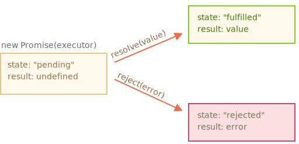

# Промисы

Синтаксис создания `Promise`:

```js
let promise = new Promise((resolve, reject) => {
    // функция-исполнитель (executor)
});
```

Функция, переданная в конструкцию `new Promise`, называется *исполнитель* (executor). Когда `Promise` создаётся, она запускается автоматически. Она должна содержать "создающий" код, который когда-нибудь создаст результат.

Её аргументы `resolve` и `reject` - это колбэки, которые предоставляет сам JavaScript. Наш код - только внутри исполнителя.

Когда он получает результат, сейчас или позже - не важно, он должен вызвать один из этих колбэков:

- `resolve(value)` — если работа завершилась успешно, с результатом `value`.
- `reject(error)` — если произошла ошибка, `error` - объект ошибки.

Итак, исполнитель запускается автоматически, он должен выполнить работу, а затем вызвать `resolve` или `reject`.

У объекта `promise`, возвращаемого конструктором `new Promise`, есть внутренние свойства:

- `state` ("состояние") — вначале `"pending"` ("ожидание"), потом меняется на  `"fulfilled"` ("выполнено успешно") при вызове `resolve` или на `"rejected"` ("выполнено с ошибкой") при вызове `reject`.
- `result` ("результат") — вначале `undefined`, далее изменяется на `value` при вызове `resolve(value)` или на `error` при вызове `reject(error)`.

Так что исполнитель по итогу переводит `promise` в одно из двух состояний:



Ниже пример конструктора `Promise` и простого исполнителя с кодом, дающим результат с задержкой (через `setTimeout`):

```js run
let promise = new Promise((resolve, reject) => {
    // эта функция выполнится автоматически, при вызове new Promise

    // через 1 секунду сигнализировать, что задача выполнена с результатом "done"
    setTimeout(() => resolve('done'), 1000);
});
```

Мы можем наблюдать две вещи, запустив код выше:

1. Функция-исполнитель запускается сразу же при вызове `new Promise`.
2. Исполнитель получает два аргумента: `resolve` и `reject` — это функции, встроенные в JavaScript, поэтому нам не нужно их писать. Нам нужно лишь позаботиться, чтобы исполнитель вызвал одну из них по готовности.

Спустя одну секунду "обработки" исполнитель вызовет `resolve("done")`, чтобы передать результат.

Это был пример успешно выполненной задачи, в результате мы получили "успешно выполненный" промис.

А теперь пример, в котором исполнитель сообщит, что задача выполнена с ошибкой:

```js run
let promise = new Promise((resolve, reject) => {
    // эта функция выполнится автоматически, при вызове new Promise

    // через 1 секунду сигнализировать, что задача выполнена с результатом "done"
    setTimeout(() => reject(new Error('Ouch!')), 1000);
});
```

Подведём промежуточные итоги: исполнитель выполняет задачу (что-то, что обычно требует времени), затем вызывает `resolve` или `reject`, чтобы изменить состояние соответствующего `Promise`.

Промис - и успешный, и отклонённый будем называть "завершённым", в отличие изначального промиса "в ожидании".

"Может быть что-то одно: либо результат, либо ошибка"

Исполнитель должен вызвать что-то одно: `resolve` или `reject`. Состояние промиса может быть изменено только один раз.

Все последующие вызовы `resolve` и `reject` будут проигнорированы:

```js
let promise = new Promise((resolve, reject) => {
    resolve('done');

    reject(new Error('...')); // игнорируется
    setTimeout(() => resolve('...'), 1000); // игнорируется
});
```

Идея в том, что задача, выполняемая исполнителем, может иметь только один итог: результат или ошибку.

Также заметим, что функция `resolve`/`reject` ожидает только один аргумент (или ни одного). Все дополнительные аргументы будут проигнорированы.

"Вызывайте `reject` с объектом `Error`"

В случае, если что-то пошло не так, мы должны вызвать `reject`. Это можно сделать с аргументом любого типа (как и `resolve`), но рекомендуется использовать объект `Error` (или унаследованный от него).

"Вызов `resolve`/`reject` сразу"

Обычно исполнитель делает что-то асинхронное и после этого вызывает `resolve`/`reject`, то есть через какое-то время. Но это не обязательно, `resolve` или `reject` могут быть вызваны сразу:

```js
let promise = new Promise((resolve, reject) => {
    // задача, не требующая времени
    resolve('123'); // мгновенно выдаст 
});

Это может случиться, например, когда мы начали выполнять какую-то задачу, но тут же увидели, что ранее её уже выполняли, и результат закеширован.

Такая ситуация нормальна. Мы сразу получим успешно завершённый `Promise`.

"Свойства `state` и `result` - внутренние"

Свойства `state` и `result` - это внутренние свойства объекта `Promise` и мы не имеем к ним прямого доступа. Для обработки результата следует использовать методы `.then`/`.catch`/`.finally`, про них речь пойдёт дальше.

## Потребители: then, catch, finally

Объект `Promise` служит связующим звеном между исполнителем ("создающим" кодом) и функциями-потребителями, которые получат либо результат, либо ошибку. Функции-потребители могут быть зарегистрированы (подписаны) с помощью методов `.then`, `.catch` и `.finally`.

### then

Наиболее важный и фундаментальный метод - `.then`.

Синтаксис:

```js
promise.then(
    result => {
        // обработает успешное выполнение
    },
    error => {
        // обработает ошибку
    }
);
```

Первый аргумент метода `.then` - функция, которая выполняется, когда промис переходит в состояние "выполнен успешно", и получает результат.

Второй аргумент `.then`  - функция, которая выполняется, когда промис переходит в состояние "выполнен с ошибкой", и получает ошибку.

Например, вот реакция на успешно выполненный промис:

```js run
let promise = new Promise((resolve, reject) => {
    setTimeout(() => resolve('done'), 1000);
})

// resolve запустит первую функцию, переданную в .then
promise.then(
    result => alert(result), // выведет "done!" через одну секунду
    error => alert(error) // не будет запущена
);
```

Выполнилась первая функция.

А в случае ошибки в промисе -- выполнится вторая:

```js run
let promise = new Promise((resolve, reject) => {
    setTimeout(() => reject(new Error('Whoops!')), 1000);
})

// resolve запустит первую функцию, переданную в .then
promise.then(
    result => alert(result), // не будет запущена
    error => alert(error) // выведет "Error: Whoops!" спустя одну секунду
);
```

Если мы заинтересованы только в результате успешного выполнения задачи, то в `then` можно передать только одну функцию:

```js run
let promise = new Promise((resolve, reject) => {
    setTimeout(() => resolve('done'), 1000);
})

// resolve запустит первую функцию, переданную в .then
promise.then(alert); // выведет "done!" спустя одну секунду
```

### catch

Если мы хотели бы только обработать ошибку, то можно использовать `null` в качестве первого аргумента: `.then(null, errorHandlingFunction)`. Или можно воспользоваться методом `.catch(errorHandlingFunction)`, который сделает тоже самое:

``js run
let promise = new Promise((resolve, reject) => {
    setTimeout(() => reject(new Error('Whoops!')), 1000);
})

// .catch(f) это тоже самое promise.then(null, f)
promise.catch(alert); // выведет "Error: Whoops!" спустя одну секунду
```

Вызов `.catch(f)` - это сокращённый, "укороченный" вариант  `.then(null, f)`.

### finally

По аналогии с блоком `finally` из обычного `try {...} catch {...}`, у промисов также есть метод `finally`.

Вызов `.finally(f)` похож на `.then(f, f)`, в том смысле, что `f` выполнится в любом случае, когда промис завершится: успешно или с ошибкой.

`finally` хорошо подходит для очистки, например остановки индикатора загрузки, его ведь нужно остановить вне зависимости от результата.

Например:

```js
new Promise((resolve, reject) => {
    /* сделать что-то, что займёт время, и после вызвать resolve/reject */
})
// выполнится, когда промис завершится, независимо от того, успешно или нет
.finally(
    () => {
        // остановить индикатор загрузки
    }
)
.then(
    res => {
        // показать результат
    },
    err => {
        // показать ошибку
    }
);
```

Но это не совсем псевдоним `then(f,f)`, как можно было подумать. Существует несколько важных отличий:

1. Обработчик, вызываемый из `finally`, не имеет аргументов. В `finally` мы не знаем, как был завершён промис. И это нормально, потому что обычно наша задача - выполнить "общие" завершающие процедуры.
2. Обработчик `finally` "пропускает" результат или ошибку дальше, к последующим обработчикам.

    Например, здесь результат проходит через `finally` к `then`:
    ```js run
    new Promise((res, rej) => {
        setTimeout(() => res('result'), 2000);
    })
    .finally(() => alert('Promise fulfilled'))
    .then(alert); // <-- .then обработает результат
    ```

    А здесь ошибка из промиса проходит через `finally` к `catch`:

    ```js run
    new Promise((res, rej) => {
        throw new Error('error');
    })
    .finally(() => alert('Promise fulfilled'))
    .catch(alert); // // <-- .catch обработает объект ошибки
    ```

    Это очень удобно, потому что `finally` не предназначен для обработки результата промиса. Так что он просто пропускает его через себя дальше.

3. Последнее, но не менее значимое: вызов `.finally(f)` удобнее, чем.`then(f, f)` - не надо дублировать функции f.

"На завершённых промисах обработчики запускаются сразу"

Если промис в состоянии ожидания, обработчики в `.then/catch/finally` будут ждать его. Однако, если промис уже завершён, то обработчики выполнятся сразу:

```js run
// мгновенный перевод промиса в состояние "успешно завершён"
let promise = new Promise(res => res('ready!'));

promise.then(alert); // ready! (выведется сразу)
```

Теперь рассмотрим несколько практических примеров того, как промисы могут облегчить нам написание асинхронного кода.

## Пример: loadScript

У нас есть функция `loadScript` для загрузки скрипта.

Так выглядел вариант с колбэками:

```js
function loadscript(src, callback) {
    let script = document.createElement('script');
    script.src = src;

    script.onload = () => callback(null, script);
    script.onerror = () => callback(new Error(`Ошибка загрузки скрипта ${src}`));

    document.head.append(script);
}
```

Теперь перепишем её, используя `Promise`.

Новой функции `loadScript` будет не нужен аргумент `callback`. Вместо этого она будет создавать и возвращать объект `Promise`, который будет переходить в состояние "успешно завершён", когда загрузка закончится. Внешний код может добавлять обработчики ("подписчиков"), используя `.then`:

```js run
function loadscript(src) {
    return new Promise((res, rej) => {
        let script = document.createElement(script);
        script.src = src;

        script.onload = () => res(script);
        script.onerror = () => rej(new Error(`Ошибка загрузки скрипта ${src}`));

        document.head.append(script);
    });
}
```

Применение:

```js run
let promise = loadscript("https://cdnjs.cloudflare.com/ajax/libs/lodash.js/4.17.11/lodash.js");

promise.then(
    script => alert(`${script.src} загружен!`),
    error => alert(`Ошибка: ${error.message}`)
);

promise.then(script => alert('Ещё один обработчик...'));
```

Сразу заметно несколько преимуществ перед подходом с использованием колбэков:

| Промисы | Колбэки |
|----------|-----------|
| Промисы позволяют делать вещи в естественном порядке. Сперва мы запускаем `loadScript(script)`, и затем (`.then`) мы пишем, что делать с результатом. | У нас должна быть функция`callback` на момент вызова `loadScript(script, callback)`. Другими словами, нам нужно знать что делать с результатом *до того*, как вызовется `loadScript`. |
| Мы можем вызывать `.then` у `Promise` столько раз, сколько захотим. Каждый раз мы добавляем нового "фаната", новую функцию-подписчика в "список подписок". 

Таким образом, промисы позволяют улучшить порядок кода и дают нам гибкость.
